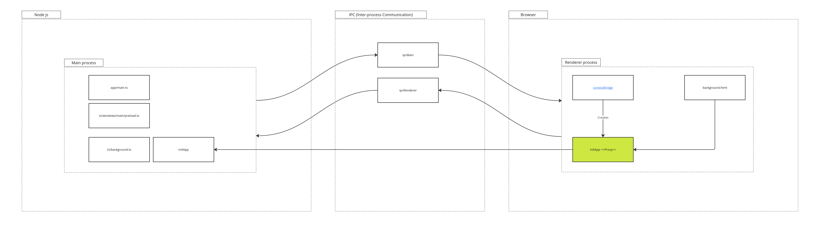

# Architecture

`Signal-Desktop` is an `Electron` application that maintains local copies of messages in a database.



## Electron

As with any `Electron` program, it is broken into two parts, a [main process and a renderer process](https://www.electronjs.org/docs/latest/tutorial/process-model#the-multi-process-model).

The main process is the part that has access to the local system, and the renderer part is essentially a browser window.

The UI part of `Signal-Desktop` is a normal single-page application written in `React`.

Both main and renderer processes have a `window` global, but they are not really the same. Window variables must be explicitly made available to the renderer process window using `contextBridge.exposeInMainWorld`.

### Main process: `app/main.ts`

`app/main.ts` is run within a node js environment and is the entrypoint for `electron`:

```shell
electron app/main.js
```

Basically `app/main.ts`:

- Runs preload script `ts/windows/main/start.ts` to populate dependencies like `window.startApp`, exposing them with `contextBridge.exposeInMainWorld`
- Creates a `BrowserWindow` and loads it with `background.html`

Part of preload is loading `ts/background.ts` which is where `startApp` is defined.

`startApp` runs in the main process so it has access to all window variables like `window.Signal`.

### Renderer process

This is started when `background.html` is loaded into a `BrowserWindow` instanc.

The application is started by this script running in the browser:

```html
<script type="text/javascript">
  window.startApp();
</script>
```

Even though `startApp` is defined in `ts/background.ts` as part of preload, it has been made available on the browser window using `contextBridge.exposeInMainWorld`.

[`contextBridge`](https://www.electronjs.org/docs/latest/api/context-bridge) is a special `Electron` construct that proxies references to the main process.

So when we invoke `window.startApp` from the browser, we're actually calling a special proxy.

## Runtime dependencies (adapters)

The [application is started](./how/how-application-is-started.md) with `startApp` in `ts/background.ts`.

Adapters are initialised either as part of the preload process or in `startApp`.

Adapters are assigned to window variables.

```shell
grep -Eiro "window\..+ = " ts --include=*.ts | sort | uniq
```

Some of these are not adapters, but it's a good start.

```shell
ts/background.ts:window.document.title =
ts/background.ts:window.Events =
ts/background.ts:window.getAccountManager =
ts/background.ts:window.getSocketStatus =
ts/background.ts:window.getSyncRequest =
ts/background.ts:window.setImmediate =
ts/background.ts:window.Signal.challengeHandler =
ts/background.ts:window.Signal.Services.lightSessionResetQueue =
ts/background.ts:window.Signal.Services.retryPlaceholders =
ts/background.ts:window.startApp =
ts/background.ts:window.textsecure.messaging =
ts/background.ts:window.textsecure.server =
ts/background.ts:window.textsecure.storage.protocol =
ts/background.ts:window.waitForEmptyEventQueue =
ts/background.ts:window.Whisper.deliveryReceiptBatcher =
ts/background.ts:window.Whisper.deliveryReceiptQueue =
ts/background.ts:window.Whisper.events.on('userChanged', (reconnect =
ts/ConversationController.ts:window.ConversationController =
ts/ConversationController.ts:window.document.title =
ts/ConversationController.ts:window.getConversations =
ts/logging/set_up_renderer_logging.ts:window.onerror =
ts/logging/set_up_renderer_logging.ts:window.SignalContext =
ts/logging/set_up_renderer_logging.ts:window.SignalContext.log =
ts/models/conversations.ts:window.Whisper =
ts/models/conversations.ts:window.Whisper.Conversation =
ts/models/conversations.ts:window.Whisper.ConversationCollection =
ts/models/messages.ts:window.Whisper =
ts/models/messages.ts:window.Whisper.Message =
ts/services/InteractionMode.ts:window.enterKeyboardMode =
ts/services/InteractionMode.ts:window.enterMouseMode =
ts/services/MessageCache.ts:window.MessageCache =
ts/SignalProtocolStore.ts:window.SignalProtocolStore =
ts/state/initializeRedux.ts:window.reduxActions =
ts/state/initializeRedux.ts:window.reduxStore =
ts/test-both/state/ducks/composer_test.ts:window.reduxActions =
ts/test-both/state/ducks/preferredReactions_test.ts:window.ConversationController =
ts/test-electron/backup/helpers.ts:window.Events =
ts/test-electron/models/messages_test.ts:window.textsecure.messaging =
ts/test-electron/state/ducks/calling_test.ts:window.Events =
ts/test-electron/textsecure/AccountManager_test.ts:window.textsecure.storage.protocol.loadKyberPreKeys =
ts/test-electron/textsecure/AccountManager_test.ts:window.textsecure.storage.protocol.loadPreKeys =
ts/test-electron/textsecure/AccountManager_test.ts:window.textsecure.storage.protocol.loadSignedPreKeys =
ts/test-electron/textsecure/AccountManager_test.ts:window.textsecure.storage.protocol.removeKyberPreKeys =
ts/test-electron/textsecure/AccountManager_test.ts:window.textsecure.storage.protocol.removePreKeys =
ts/test-electron/textsecure/AccountManager_test.ts:window.textsecure.storage.protocol.removeSignedPreKeys =
ts/textsecure/Storage.ts:window.storage =
ts/util/batcher.ts:window.batchers =
ts/util/batcher.ts:window.waitForAllBatchers =
ts/util/openLinkInWebBrowser.ts:window.location.href =
ts/util/waitBatcher.ts:window.flushAllWaitBatchers =
ts/util/waitBatcher.ts:window.waitBatchers =
ts/util/waitBatcher.ts:window.waitForAllWaitBatchers =
ts/windows/context.ts:window.i18n =
ts/windows/context.ts:window.SignalContext =
ts/windows/loading/start.ts:window.i18n =
ts/windows/main/phase1-ipc.ts:window.eval = global.eval =
ts/windows/main/phase1-ipc.ts:window.Flags =
ts/windows/main/phase1-ipc.ts:window.getAppInstance =
ts/windows/main/phase1-ipc.ts:window.getBackupServerPublicParams =
ts/windows/main/phase1-ipc.ts:window.getBuildCreation =
ts/windows/main/phase1-ipc.ts:window.getBuildExpiration =
ts/windows/main/phase1-ipc.ts:window.getEnvironment =
ts/windows/main/phase1-ipc.ts:window.getGenericServerPublicParams =
ts/windows/main/phase1-ipc.ts:window.getHostName =
ts/windows/main/phase1-ipc.ts:window.getServerPublicParams =
ts/windows/main/phase1-ipc.ts:window.getServerTrustRoot =
ts/windows/main/phase1-ipc.ts:window.getSfuUrl =
ts/windows/main/phase1-ipc.ts:window.getTitle =
ts/windows/main/phase1-ipc.ts:window.getVersion =
ts/windows/main/phase1-ipc.ts:window.i18n =
ts/windows/main/phase1-ipc.ts:window.initialTheme =
ts/windows/main/phase1-ipc.ts:window.IPC =
ts/windows/main/phase1-ipc.ts:window.isAfterVersion =
ts/windows/main/phase1-ipc.ts:window.isBeforeVersion =
ts/windows/main/phase1-ipc.ts:window.logAuthenticatedConnect =
ts/windows/main/phase1-ipc.ts:window.open =
ts/windows/main/phase1-ipc.ts:window.platform =
ts/windows/main/phase1-ipc.ts:window.RETRY_DELAY =
ts/windows/main/phase1-ipc.ts:window.sendChallengeRequest =
ts/windows/main/phase2-dependencies.ts:window.Backbone =
ts/windows/main/phase2-dependencies.ts:window.BasePaths =
ts/windows/main/phase2-dependencies.ts:window.libphonenumberFormat =
ts/windows/main/phase2-dependencies.ts:window.libphonenumberInstance =
ts/windows/main/phase2-dependencies.ts:window.nodeSetImmediate =
ts/windows/main/phase2-dependencies.ts:window.React =
ts/windows/main/phase2-dependencies.ts:window.ReactDOM =
ts/windows/main/phase2-dependencies.ts:window.Signal =
ts/windows/main/phase2-dependencies.ts:window.textsecure =
ts/windows/main/phase2-dependencies.ts:window.WebAPI =
ts/windows/main/phase4-test.ts:window.SignalCI =
ts/windows/main/preload_test.ts:window.assert =
ts/windows/main/preload_test.ts:window.getSignalProtocolStore =
ts/windows/main/preload_test.ts:window.testUtilities =
ts/windows/main/preload.ts:window.preloadEndTime =
ts/windows/main/preload.ts:window.preloadStartTime =
ts/windows/main/start.ts:window.Flags[name] =
ts/windows/main/start.ts:window.Signal.Services.calling._iceServerOverride =
ts/windows/main/start.ts:window.Signal.Services.calling._sfuUrl =
ts/windows/main/start.ts:window.Whisper.events =
ts/windows/sandboxedInit.ts:window.i18n =
```

I would say these are for sure adapters in the ports-and-adapters sense:

```shell
ts/windows/main/phase2-dependencies.ts:window.Signal
ts/windows/main/phase2-dependencies.ts:window.textsecure
ts/windows/main/phase2-dependencies.ts:window.WebAPI
```
