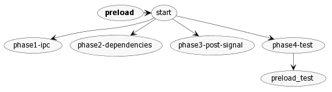

# Architecture

## Runtime dependencies (adapters)

The [application is started](./how/how-application-is-started.md) with `startApp` in `ts/background.ts`.

`startApp` is responssible for configuring the adapter used by the application running in the browser.

The running application finds these dependencies on `window`.

### `window.Signal` (`ts/signal.ts`)

`window.Signal` is assigned in `ts/windows/main/phase2-dependencies.ts`.

`window.Signal` provides access to ...

#### `setup` (`ts/signal.ts`)

`setup` configures all of the adapter implementations

## App

```shell
npx arkit ../Signal-Desktop/app/ -o ./assets/architecture/app-architecture.png
```


## /app/main.ts

```shell
npx arkit -f ../Signal-Desktop/app/main.ts -d ../Signal-Desktop/app -o ./assets/architecture/electron-app-architecture.png
```


## /app/preload.ts

```shell
npx arkit -f ../Signal-Desktop/ts/windows/main/preload.ts  -d ../Signal-Desktop/ts/windows/main -o ./assets/architecture/electron-preload.png
```



## /ts/background.ts

This one succeeds (after a long time) but the resulting image contains errors.

```shell
npx arkit -f ../Signal-Desktop/ts/background.ts -d ../Signal-Desktop/ts -o ./assets/architecture/background-architecture.png
```

`background-architecture.png` ends up empty:

```shell
ls -sh -w 1 assets/architecture/
total 240K
164K app-architecture.png
   0 background-architecture.png
 76K electron-app-architecture.png
```
