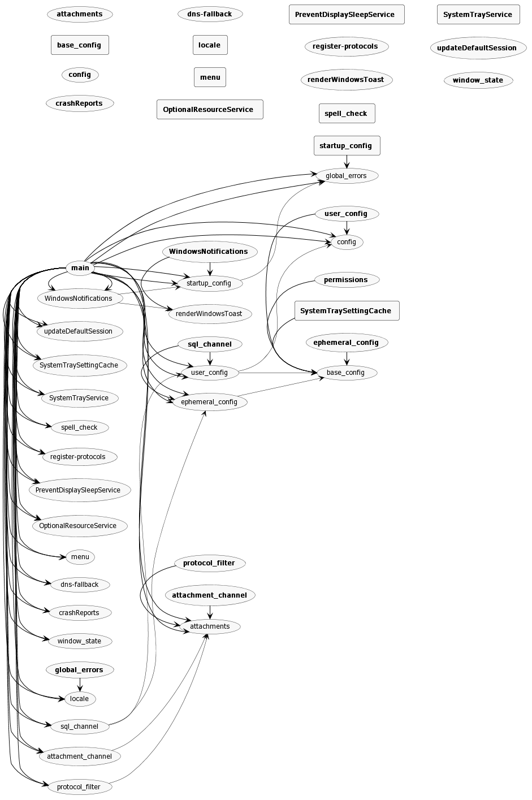

## App

```shell
npx arkit ../Signal-Desktop/app/ -o ./assets/architecture/app-architecture.png
```



## /app/main.ts

```shell
npx arkit -f ../Signal-Desktop/app/main.ts -d ../Signal-Desktop/app -o ./assets/architecture/electron-app-architecture.png
```


## /ts/background.ts

This one succeeds (after a long time) but the resulting image contains errors.

```shell
npx arkit -f ../Signal-Desktop/ts/background.ts -d ../Signal-Desktop/ts -o ./assets/architecture/background-architecture.png
```

`background-architecture.png` ends up empty:

```shell
ls -sh -w 1 assets/architecture/
total 240K
164K app-architecture.png
   0 background-architecture.png
 76K electron-app-architecture.png
```
