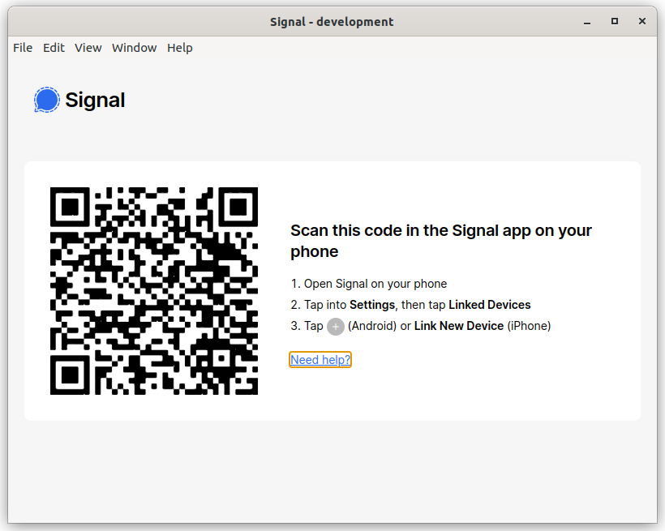

# 3. Bypass the QR code

Date: 2024-06-21

## Status

Accepted

## Context



We have managed to substitute `window.Signal` with a fake, now we would like to get past the QR code view.

The QR code is shown conditionally by `SmartInstallScreen`.

```ts
// ts/components/App.tsx
if (appView === AppViewType.Installer) {
  contents = <SmartInstallScreen />;
} else if (appView === AppViewType.Standalone) {
  const onComplete = () => {
    window.IPC.removeSetupMenuItems();
    openInbox();
  };
  contents = (
    <StandaloneRegistration
      onComplete={onComplete}
      requestVerification={requestVerification}
      registerSingleDevice={registerSingleDevice}
    />
  );
} else if (appView === AppViewType.Inbox) {
  contents = renderInbox();
}
```

Where `appView`:

```ts
export enum AppViewType {
  Blank = "Blank",
  Inbox = "Inbox",
  Installer = "Installer",
  Standalone = "Standalone",
}
```

`SmartInstallScreen` is shown when `appView === AppViewType.Installer`.

This is assigned by `window.reduxActions.app.openInstaller` in 2 places:

```ts
// ts/background.ts
window.Whisper.events.on("setupAsNewDevice", () => {
  window.IPC.readyForUpdates();
  window.reduxActions.app.openInstaller();
});

// ...

if (isCoreDataValid && Registration.everDone()) {
  drop(connect());
  window.reduxActions.app.openInbox();
} else {
  window.IPC.readyForUpdates();
  window.reduxActions.app.openInstaller();
}

const isCoreDataValid = Boolean(
  window.textsecure.storage.user.getAci() &&
    window.ConversationController.getOurConversation()
);
```

```ts
// ts/util/registration.ts
export function everDone(): boolean {
  return window.storage.get("chromiumRegistrationDoneEver") === "" || isDone();
}
```

## Decision

### Try and make `isCoreDataValid` true

#### window.textsecure.storage.user.getAci()

To do this we need to replace `window.textsecure`, which is also assigned at startup.

```ts
// ts/windows/main/phase2-dependencies.ts
window.textsecure = textsecure;
```

where `textsecure`:

```ts
// ts/textsecure/index.ts
export const textsecure: TextSecureType = {
  utils,
  storage: new Storage(),

  AccountManager,
  EventTarget,
  MessageReceiver,
  MessageSender,
  SyncRequest,
  WebAPI,
  WebSocketResource,
};
```

Note that it is initialised as a constant meaning it creates an instance of `Storage`.

Rather than fluff around making that work, it's easier to convert `textsecure` to a function, that way `new Storage()` is not always called.

One other thing to note is that the `Storage` ctor assigns itself to `window.storage`:

```ts
// ts/textsecure/Storage.ts
constructor() {
  //...
  window.storage = this;
}
```

We'll need to replicate that behaviour.

#### window.ConversationController.getOurConversation()

Extracting the interface is straightforward. Replacing it at runtime is more difficult.

We need to get into

```ts
// ts/ConversationController.ts
export function start(): void {
  const conversations = new window.Whisper.ConversationCollection();

  window.ConversationController = new ConversationController(conversations);
  window.getConversations = () => conversations;
}
```

Now `getOurConversation` just needs to return a defined value.

### Try and make `Registration.everDone()` true

You can just call this:

```ts
// ts/util/registration.ts
markEverDone;
```

But how do we represent that?

It needs to be awaited, where is the best place to put that?

How about `window.Signal.init`?

## Consequences

Once we can get past the QR code, we can start to use the actual program.

## Notes

### OurProfileKeyService.initialize -- Cannot read properties of undefined (reading 'onready')

```
ERROR 2024-06-21T02:25:31.917Z Top-level unhandled promise rejection: TypeError: Cannot read properties of undefined (reading 'onready')
    at /home/ben/sauce/Signal-Desktop/preload.bundle.js:136900:19
    at new Promise (<anonymous>)
    at OurProfileKeyService.initialize (/home/ben/sauce/Signal-Desktop/preload.bundle.js:136899:37)
    at startApp (/home/ben/sauce/Signal-Desktop/preload.bundle.js:316425:24)
```

This is due to:

```ts
// ts/background.ts
ourProfileKeyService.initialize(window.storage);
```

### Error: Must have our own ACI

```shell
VM113 preload.bundle.js:11419 Uncaught (in promise) Error: Must have our own ACI
    at strictAssert (VM113 preload.bundle.js:11419:11)
    at User.getCheckedAci (VM113 preload.bundle.js:180003:9)
    at flushAttachmentDownloadQueue (VM113 preload.bundle.js:207142:33)
    at process.processTicksAndRejections (VM26 task_queues:95:5)
    at async onEmpty (VM113 preload.bundle.js:317938:5)
strictAssert	@	VM113 preload.bundle.js:11419
getCheckedAci	@	VM113 preload.bundle.js:180003
flushAttachmentDownloadQueue	@	VM113 preload.bundle.js:207142
processTicksAndRejections	@	VM26 task_queues:95
await in processTicksAndRejections (async)
processTicksAndRejections	@	VM26 task_queues:95
await in processTicksAndRejections (async)
processTicksAndRejections	@	VM26 task_queues:95
await in processTicksAndRejections (async)
unlinkAndDisconnect	@	VM113 preload.bundle.js:318672
processTicksAndRejections	@	VM26 task_queues:95
await in processTicksAndRejections (async)
processTicksAndRejections	@	VM26 task_queues:95
await in processTicksAndRejections (async)
(anonymous)	@	VM113 preload.bundle.js:317394
triggerEvents	@	VM113 preload.bundle.js:319407
trigger	@	VM113 preload.bundle.js:319365
(anonymous)	@	VM113 preload.bundle.js:138330
emit	@	VM21 node:events:518
emit	@	VM113 preload.bundle.js:67908
authenticate	@	VM113 preload.bundle.js:67422
processTicksAndRejections	@	VM26 task_queues:95
await in processTicksAndRejections (async)
connect3	@	VM113 preload.bundle.js:138333
(anonymous)	@	VM113 preload.bundle.js:316685
(anonymous)	@	VM113 preload.bundle.js:302453
callListeners	@	VM113 preload.bundle.js:302453
fetch	@	VM113 preload.bundle.js:302444
startApp	@	VM113 preload.bundle.js:317253
await in startApp (async)
(anonymous)	@	background.html:119
```

`User.getCheckedAci` was returning undefined because we had two different instances of `DevNullStorage` in use.

```ts
// flushAttachmentDownloadQueue
log.info(
  "onEmpty flushAttachmentDownloadQueue saveMessages storage.initialised",
  // @ts-expect-error "ABC"
  window.storage.initialised,
  window.storage, // (1)
  window.textsecure.storage, // (2)
  window.storage.user.getAci()
);
```

Prints two different ids and `(1)` is not initialised.

This was because of

```ts
// ts/ports/ports.ts
export const devNull: () => Ports = () => ({
  initializeGroupCredentialFetcher: DevNullInitializeGroupCredentialFetcher,
  remoteConfig: new DevNullRemoteConfig(),
  textsecure: create(), // <---- this invokes `DevNullStorage` ctor
});
```

Anyone calling `devNull` would overwrite `window.storage` because `DevNullStorage` was assigning `window.storage`.
