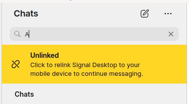

# 4. Inject fake contacts

Date: 2024-06-23

## Status

Accepted

## Context

We are reading real contacts, so we'd like to be able to add fakes ones.

### Where contacts come from

`ts/components/ChatsTab.tsx` => `renderLeftPane` => `SmartLeftPane`



Looks like it ends up at `doSearch`.

```ts
// ts/state/ducks/search.ts
const doSearch = debounce(
  ({
    dispatch,
    allConversations,
    regionCode,
    noteToSelf,
    ourConversationId,
    query,
    searchConversationId,
  }: Readonly<{
    dispatch: ThunkDispatch<
      RootStateType,
      unknown,
      | SearchMessagesResultsFulfilledActionType
      | SearchDiscussionsResultsFulfilledActionType
    >;
    allConversations: ReadonlyArray<ConversationType>;
    noteToSelf: string;
    regionCode: string | undefined;
    ourConversationId: string;
    query: string;
    searchConversationId: undefined | string;
  }>) => {
    if (!query) {
      return;
    }

    // Limit the number of contacts to something reasonable
    const MAX_MATCHING_CONTACTS = 100;

    void (async () => {
      const segmenter = new Intl.Segmenter([], { granularity: "word" });
      const queryWords = [...segmenter.segment(query)]
        .filter((word) => word.isWordLike)
        .map((word) => word.segment);
      const contactServiceIdsMatchingQuery = searchConversationTitles(
        allConversations,
        queryWords
      )
        .filter((conversation) => isDirectConversation(conversation))
        .map((conversation) => conversation.serviceId)
        .filter(isNotNil)
        .slice(0, MAX_MATCHING_CONTACTS);

      const messages = await queryMessages({
        query,
        searchConversationId,
        contactServiceIdsMatchingQuery,
      });

      dispatch({
        type: "SEARCH_MESSAGES_RESULTS_FULFILLED",
        payload: {
          messages,
          query,
        },
      });
    })();

    if (!searchConversationId) {
      void (async () => {
        const { conversationIds, contactIds } =
          await queryConversationsAndContacts(query, {
            ourConversationId,
            noteToSelf,
            regionCode,
            allConversations,
          });

        dispatch({
          type: "SEARCH_DISCUSSIONS_RESULTS_FULFILLED",
          payload: {
            conversationIds,
            contactIds,
            query,
          },
        });
      })();
    }
  },
  200
);
```

I think the contacts come from `allConversations` which come from `window.ConversationController`.

### Where conversations results come from

These are sourced directly from the database (via `Electron`) instead of via the contacts controller.

- `updateSearchTerm` dispatched in `ts/state/smart/LeftPane.tsx`
- `updateSearchTerm` (`ts/state/ducks/search.ts`)
- `doSearch` (`ts/state/ducks/search.ts`)
- `queryMessages` (`ts/state/ducks/search.ts`)
- `dataSearchMessages` (`ts/sql/Client.ts`)

### Implementing `ConversationController`

When `DevNullConversationController` without any setup, the loading bubbles show, so we need to inject some fake data.

#### Getting past loading bubbles

## Decision

The change that we're proposing or have agreed to implement.

## Consequences

What becomes easier or more difficult to do and any risks introduced by the change that will need to be mitigated.

## Notes
