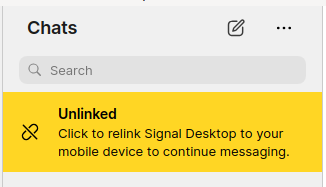

# 8. Bypass the unlinked message

Date: 2024-07-04

## Status

Accepted

## Context



> Click to relink Signal Desktop to your mobile device to continue messaging.

```json
"icu:unlinkedWarning": {
    "messageformat": "Click to relink Signal Desktop to your mobile device to continue messaging."
  },
```

This is shown by `DialogRelink` when this is true:

```ts
// ts/state/smart/LeftPane.tsx
const hasRelinkDialog = !isRegistrationDone();
```

which amounts to:

```ts
// ts/util/registration.ts
export function isDone(): boolean {
  return window.storage.get("chromiumRegistrationDone") === "";
}
```

## Decision

### Set registration as done

To do this we can use `markDone` from `ts/util/registration.ts`.

We are doing this in `DevNullStorage.init` because it is an async process.

`DevNullStorage.init` is called from early in the process:

```ts
// ts/background.ts
export async function startApp(): Promise<void> {
  window.textsecure.storage.protocol = new window.SignalProtocolStore();
  await window.Signal.init();
  await window.textsecure.storage.init(); // <--------------------------------------- here
  // ...
}
```

## Problems

### We are being unlinked for some reason

1. `unlinkAndDisconnect` (`ts/background.ts`)
1. `void Registration.remove();`

There are a few reasons `unlinkAndDisconnect` is called.

```shell
at unlinkAndDisconnect (/home/ben/sauce/Signal-Desktop/preload.bundle.js:319321:33)
    at Object.<anonymous> (/home/ben/sauce/Signal-Desktop/preload.bundle.js:318049:10)
    at triggerEvents (/home/ben/sauce/Signal-Desktop/preload.bundle.js:320071:42)
    at Object.trigger (/home/ben/sauce/Signal-Desktop/preload.bundle.js:320029:5)
    at SocketManager.<anonymous> (/home/ben/sauce/Signal-Desktop/preload.bundle.js:138339:29)
    at SocketManager.emit (node:events:518:28)
    at SocketManager.emit (/home/ben/sauce/Signal-Desktop/preload.bundle.js:67908:22)
    at SocketManager.authenticate (/home/ben/sauce/Signal-Desktop/preload.bundle.js:67422:20)
    at process.processTicksAndRejections (node:internal/process/task_queues:95:5)
```

`SocketManager.authenticate` comes from `ts/textsecure/SocketManager.ts`.

We don't really want any socket connections at all if we can help it.

This is happening because we're initializing `ts/textsecure/WebAPI.ts`, which always tries to authenticate.

This is always going to be a problem unless we use a fake `WebAPI`.

```ts
// ts/background.ts
server = window.WebAPI.connect({
  ...window.textsecure.storage.user.getWebAPICredentials(),
  hasStoriesDisabled: window.storage.get("hasStoriesDisabled", false),
});
```

Do this instead:

```ts
// ts/background.ts
server = new DevNullWebAPIType();
```

The trouble with that is now we're stuck on the loading screen. There is clearly some behaviour we are missing.

Looks like `app/INITIAL_LOAD_COMPLETE` is not dispatched.

The only place that is dispatched is at:

```ts
// ts/background.ts
window.reduxActions.app.initialLoadComplete();
```

And the only practical path is:

- `messageReceiver.addEventListener('empty', queuedEventListener(onEmpty))`
- `onEmpty`
- `window.reduxActions.app.initialLoadComplete`

So we have to `EmptyEvent` notification in `EventTargetMessageReceiver` ctor.

### Problems with v2 groups?

When you call `format` on `ts/models/conversation-model.ts` which calls `getConversation` which calls `format` again when group version is 2.

```ts
// ts/models/conversation-model.ts
format(): ConversationType {
    // eslint-disable-next-line no-console
    console.log({ cachedProps: this.cachedProps });
    if (this.cachedProps) {
      return this.cachedProps;
    }

    const oldFormat = this.format;
    // We don't want to crash or have an infinite loop if we loop back into this function
    //   again. We'll log a warning and returned old cached props or throw an error.
    this.format = () => {
      if (!this.oldCachedProps) {
        throw new Error(
          `Conversation.format()/${this.idForLogging()} reentrant call, no old cached props!`
        );
      }

      const { stack } = new Error('for stack');
      log.warn(
        `Conversation.format()/${this.idForLogging()} reentrant call! ${stack}`
      );

      return this.oldCachedProps;
    };

    try {
      const { oldCachedProps } = this;
      const newCachedProps = getConversation(this);

      if (oldCachedProps && isShallowEqual(oldCachedProps, newCachedProps)) {
        this.cachedProps = oldCachedProps;
      } else {
        this.cachedProps = newCachedProps;
      }

      return this.cachedProps;
    } finally {
      this.format = oldFormat;
    }
  }
```

It calls `getConversation`, which under certain calls `format` again when group version is 2.

```ts
// ts/util/getConversation.ts
const sortedGroupMembers = isGroupV2(attributes)
  ? getConversationMembers(attributes)
      .sort((left, right) => sortConversationTitles(left, right))
      .map((member) => window.ConversationController.get(member.id)?.format())
      .filter(isNotNil)
  : undefined;
```

This fails with:

```shell
Uncaught (in promise) Error: Conversation.format()/PNI:dc46c18a-39eb-4251-be05-d00c00e605f2 (cfcdd0fa-ca11-4044-b282-e69d98107f40) reentrant call, no old cached props!
    at ConversationModel.format (VM113 preload.bundle.js:310150:19)
    at VM113 preload.bundle.js:308247:211
    at Array.map (<anonymous>)
    at getConversation (VM113 preload.bundle.js:308247:149)
    at ConversationModel.format (VM113 preload.bundle.js:310162:34)
    at VM113 preload.bundle.js:316013:36
    at arrayMap (VM113 preload.bundle.js:523:27)
    at Function.map (VM113 preload.bundle.js:4101:18)
    at Backbone3.Collection.map (VM113 preload.bundle.js:69387:34)
    at getInitialState (VM113 preload.bundle.js:316012:50)
format @ VM113 preload.bundle.js:310150
(anonymous) @ VM113 preload.bundle.js:308247
getConversation @ VM113 preload.bundle.js:308247
format @ VM113 preload.bundle.js:310162
(anonymous) @ VM113 preload.bundle.js:316013
arrayMap @ VM113 preload.bundle.js:523
map @ VM113 preload.bundle.js:4101
(anonymous) @ VM113 preload.bundle.js:69387
getInitialState @ VM113 preload.bundle.js:316012
initializeRedux @ VM113 preload.bundle.js:316156
setupAppState @ VM113 preload.bundle.js:318095
(anonymous) @ VM113 preload.bundle.js:318065
await in (anonymous) (async)
(anonymous) @ VM113 preload.bundle.js:302566
callListeners @ VM113 preload.bundle.js:302566
fetch @ VM113 preload.bundle.js:302557
startApp @ VM113 preload.bundle.js:318089
await in startApp (async)
(anonymous) @ background.html:119
```

The above error only seems to happen with `type: 'private'` messages:

```ts
{
  id: 'cfcdd0fa-ca11-4044-b282-e69d98107f40',
  type: 'private',
  ...createNewGroup(),
  version: 0,
  addedBy: 'dc4098ad-dd0f-4250-a05b-796716d2b838',
  description: 'A B C',
  members: ['dc4098ad-dd0f-4250-a05b-796716d2b838'],
  name: 'Note to self',
  serviceId: 'PNI:dc46c18a-39eb-4251-be05-d00c00e605f2' as PniString,
},
```

## Consequences

What becomes easier or more difficult to do and any risks introduced by the change that will need to be mitigated.
