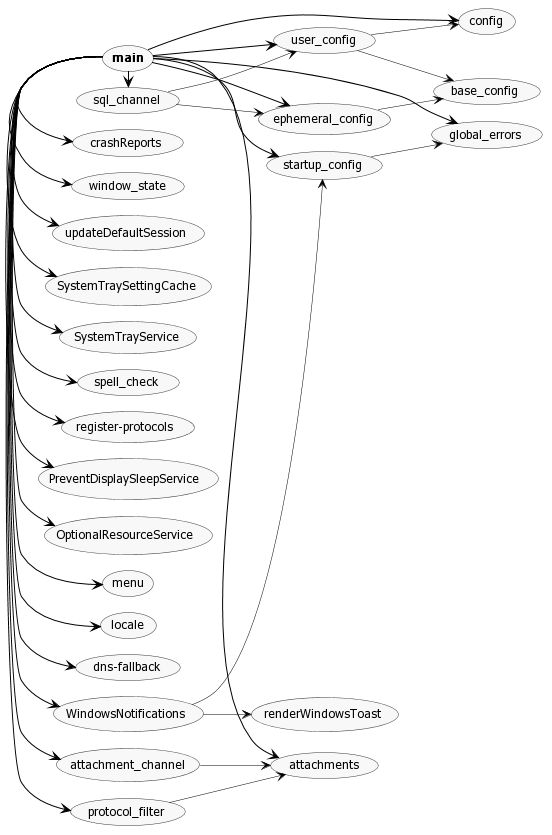

# How application is started

`Signal-Desktop` is an Electron application which is started in deveopment mode by:

```shell
yarn start
```

Which just invokes electron:

```shell
electron .
```

- `electron .` executes `app/main.ts`
- `app/main.ts` -> `import { app } from 'electron';`
- `app/main.ts` -> `app.on('ready')`
- `app/main.ts` `app.on('ready')` -> `createWindow`
- `app/main.ts` `createWindow`
- `app/main.ts` -> `createWindow` -> `mainWindow = new BrowserWindow(windowOptions);`
- `app/main.ts` -> `createWindow` -> `mainWindow .loadURL('background.html')`
- `background.html` -> `window.startApp();`
- `ts/background.ts` -> `startApp`

## `app/main.ts`



## `window.startApp`

See `ts/background.ts`.

`window.startApp` depends on:

- `window`
- `document`
- `app` (`Electron`)
- `ipc` (`Electron`)

It also:

- Assigns `window.getAccountManager` (may be useful later)
- Calls `initializeRedux`
- Cals `window.getConversations`

## Where is the React part started?

I think this happens in `ts/background.ts`:

```ts
// Around line 1455
render(
  window.Signal.State.Roots.createApp(window.reduxStore),
  document.getElementById("app-container")
);
```

Where `createApp` from from `ts/state/roots/createApp.tsx`.
