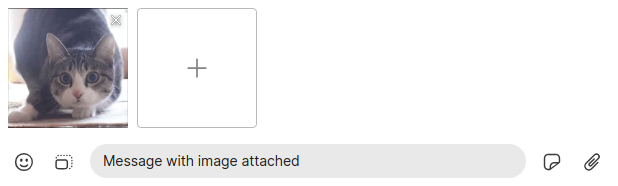

# How files are processed



An image may be attached to a message.

- `sendMultiMediaMessage` (`ts/state/ducks/composer.ts`)
- `resolveAttachmentDraftData` (`ts/util/resolveAttachmentDraftData.ts`)
- `readDraftData`
- `createEncryptedReader` (`ts/signal.ts`)
- `readAndDecryptDataFromDisk` (`app/attachments.ts`)
- `decryptAttachmentV2ToSink` (`ts/AttachmentCrypto.ts`)

There are tests for some related functions in `ts/test-electron/Crypto_test.ts`.

## How to run a single electron test

Run them all with:

```shell
npm run test-electron
```

- `ts/scripts/test-electron.ts`
- `test/index.html`
- `test/test.js`

```ts
// app/main.ts
await safeLoadURL(
  mainWindow,
  getEnvironment() === Environment.Test
    ? await prepareFileUrl([__dirname, "../test/index.html"])
    : await prepareFileUrl([__dirname, "../background.html"])
);
```

These tests are run inside an `electron` instance. The tests are collected with

```ts
//ts/windows/main/preload_test.ts
prepareTests() {
  console.log('Preparing tests...');
  sync('../../test-{both,electron}/**/*_test.js', {
    absolute: true,
    cwd: __dirname,
  }).forEach(require);
},
```

But based on `ts/scripts/test-electron.ts`, to run a single one:

## Image processing

### encryptAndUploadAttachment

# Issues

- [Transparent Png Doesn't Work (Even With Files)](https://github.com/signalapp/Signal-Desktop/issues/6928)
- [File size increase when sending images](https://github.com/signalapp/Signal-Desktop/issues/6881)
