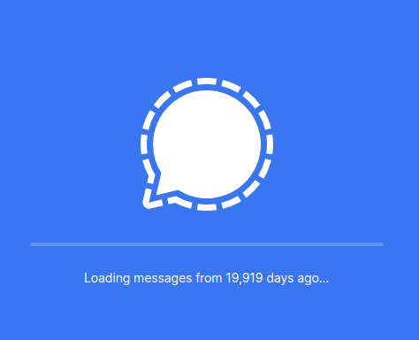

# How the onbox works

## First load

When you open Signal Desktop it checks to see if you have new messages to download. If it finds some, it shows a message like

> Loading messages from 9 days ago.

See `icu:loadingMessages--other` and `ts/components/Inbox.tsx`.



The message shows while `window.reduxStore.getState().app.hasInitialLoadCompleted` is false and `window.getSocketStatus` is not `CLOSING` or `CLOSED`.

The text shown depends on the value of the `serverTimestamp` field of the `envelopeUnsealed` or `envelopeQueued` events.

### How to trigger this condition: `envelopeTimestamp`

One of three messages is shown depending on the value of `envelopeTimestamp`.

```ts
// ts/components/Inbox.tsx
if (envelopeTimestamp !== undefined) {
  const daysBeforeMidnight = Math.ceil((midnight - envelopeTimestamp) / DAY);

  if (daysBeforeMidnight <= 0) {
    message = i18n("icu:loadingMessages--today");
  } else if (daysBeforeMidnight === 1) {
    message = i18n("icu:loadingMessages--yesterday");
  } else {
    message = i18n("icu:loadingMessages--other", {
      daysAgo: daysBeforeMidnight,
    });
  }
}
```

`envelopeTimestamp` is assigned by the `window.reduxActions.inbox.setInboxEnvelopeTimestamp` action. (See the reducer [here](ts/state/ducks/inbox.ts).)

```ts
// ts/background.ts
const _throttledSetInboxEnvelopeTimestamp = throttle(
  (serverTimestamp) => {
    window.reduxActions.inbox.setInboxEnvelopeTimestamp(serverTimestamp);
  },
  100,
  { leading: false }
);

function setInboxEnvelopeTimestamp(timestamp: number): void {
  // This timestamp is only used in the loading screen UI. If the app has loaded, let's
  // not set it to avoid unnecessary renders
  if (!window.reduxStore.getState().app.hasInitialLoadCompleted) {
    _throttledSetInboxEnvelopeTimestamp(timestamp);
  }
}
```

The only place `window.reduxActions.inbox.setInboxEnvelopeTimestamp` is called from is from handlers for `envelopeUnsealed` and `envelopeQueued`.

```ts
// ts/background.ts
messageReceiver.addEventListener(
  "envelopeUnsealed",
  queuedEventListener(onEnvelopeUnsealed, false)
);
messageReceiver.addEventListener(
  "envelopeQueued",
  queuedEventListener(onEnvelopeQueued, false)
);
```

Recall that events are communicated via the `MessageReceiver`.

Note that the events have to be raise **before** `window.reduxStore.getState().app.hasInitialLoadCompleted` is true.

## Showing inbox view
