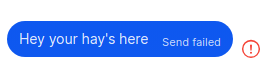

# How messages are sent

1. `sendMultiMediaMessage` (`ts/state/ducks/composer.ts`)
1. `conversation.enqueueMessageForSend`

The thing that actually sends the message is `MessageSender` which is impemented with `WebAPIType` (`window.server`).

The queueing hopefully we can can keep.

## ConversationModel.enqueueMessageForSend

```ts
// ts/state/ducks/composer.ts
const conversation = window.ConversationController.get(conversationId);

// ...
await conversation.enqueueMessageForSend(
  {
    body: message,
    attachments,
    quote,
    preview: getLinkPreviewForSend(message),
    bodyRanges,
  },
  {
    sendHQImages,
    timestamp,
    // We rely on enqueueMessageForSend to call these within redux's batch
    extraReduxActions: () => {
      conversation.setMarkedUnread(false);
      resetLinkPreview(conversationId);
      drop(clearConversationDraftAttachments(conversationId, draftAttachments));
      setQuoteByMessageId(conversationId, undefined)(
        dispatch,
        getState,
        undefined
      );
      dispatch(incrementSendCounter(conversationId));
      dispatch(setComposerDisabledState(conversationId, false));

      if (state.items.audioMessage) {
        drop(new Sound({ soundType: SoundType.Whoosh }).play());
      }
    },
  }
);
```

### window.Signal.Data.saveMessage

We have a port for this already: `ClientInterface`.

## `sendNormalMessage`

### `sendToGroup` (`ts/util/sendToGroup.ts`)

Uses `window.textsecure.messaging.sendGroupProto`.

The default implementation of `window.textsecure.messaging` uses `WebAPIType` to send messages.

`window.textsecure.messaging` is initialised in `ts/background.ts`

```ts
// ts/background.ts
window.storage.onready(async () => {
  // ...
  server = window.WebAPI.connect({
    ...window.textsecure.storage.user.getWebAPICredentials(),
    hasStoriesDisabled: window.storage.get("hasStoriesDisabled", false),
  });

  window.textsecure.server = server;
  window.textsecure.messaging = new window.textsecure.MessageSender(server);

  // ...
});
```

## Message authoring

Here is an incoming message which I have read directly from the database using

```shell
./cli message ~/.config/Signal 023b80f5-6a9a-4298-b47a-2958c8dae726 --build
```

```json
{
  "timestamp": 1717362273317,
  "attachments": [],
  "id": "023b80f5-6a9a-4298-b47a-2958c8dae726",
  "conversationId": "ec3dff29-5c9e-439c-8586-a5d88f9b24cb",
  "readStatus": 0,
  "received_at": 1717113224077,
  "received_at_ms": 1717452299315,
  "seenStatus": 2,
  "sent_at": 1717362273317,
  "serverGuid": "d9620c78-017d-43f7-be78-4baf9f94455a",
  "serverTimestamp": 1717362273630,
  "sourceDevice": 1,
  "sourceServiceId": "a37738b9-78f4-4c8c-aeb3-ac3880682bbd",
  "type": "incoming",
  "unidentifiedDeliveryReceived": true,
  "schemaVersion": 11,
  "body": "That’s woken him up!!!",
  "bodyRanges": [],
  "contact": [],
  "decrypted_at": 1717452300053,
  "errors": [],
  "flags": 0,
  "hasAttachments": 0,
  "isViewOnce": false,
  "mentionsMe": false,
  "preview": [],
  "requiredProtocolVersion": 0,
  "supportedVersionAtReceive": 7
}
```

The author of the message is identified by `sourceServiceId`.

So you can find the conversation matching:

```shell
./cli conversation ~/.config/Signal a37738b9-78f4-4c8c-aeb3-ac3880682bbd --build
```

because we know contacts are stored in the conversation table.

```json
{
  "conversation": {
    "unreadCount": 0,
    "verified": 0,
    "messageCount": 13,
    "sentMessageCount": 4,
    "id": "b46a191d-4c08-4942-9870-433d34536ca8",
    "serviceId": "a37738b9-78f4-4c8c-aeb3-ac3880682bbd",
    "type": "private",
    "version": 2,
    "pni": "PNI:577759dc-3c29-4ff7-8e70-121e8d7ef64a",
    "sealedSender": 1,
    "color": "A110",
    "profileKeyCredential": "...",
    "profileKeyCredentialExpiration": 1721433600000,
    "accessKey": "X66gD7PIbWUkQ+yQql330w==",
    "profileKey": "b65xKD7UPFJ14RHgVOL7WTa0xEBgr2DHNB7cdPunCJc=",
    "profileName": "Christina",
    "profileFamilyName": "Ward",
    "systemGivenName": "Christina",
    "systemFamilyName": "Ward",
    "messageRequestResponseType": 1,
    "profileSharing": true,
    "hideStory": false,
    "isArchived": false,
    "markedUnread": false,
    "storageVersion": 742,
    "muteExpiresAt": 0,
    "sharingPhoneNumber": false,
    "capabilities": { "paymentActivation": true, "deleteSync": false },
    "lastProfile": {
      "profileKey": "b65xKD7UPFJ14RHgVOL7WTa0xEBgr2DHNB7cdPunCJc=",
      "profileKeyVersion": "0c6563329dc7f58efed54b569d3c43bc1f12b59a8712f25f288dde698e7a8873"
    },
    "name": "Christina Ward",
    "inbox_position": 9,
    "avatar": null,
    "active_at": 1720135493117,
    "unreadMentionsCount": 0,
    "lastMessage": "Crikey!",
    "lastMessageBodyRanges": [],
    "lastMessageAuthor": "Christina",
    "lastMessageStatus": null,
    "lastMessageReceivedAt": 1717631837674,
    "lastMessageReceivedAtMs": 1720135486846,
    "timestamp": 1718165692207
  },
  "messages": []
}
```

### How real application loads messages

Messages are loaded by `ClientInterface` using methods like `getOlderMessagesByConversation` and `getNewerMessagesByConversation`.

# Troubleshooting

## Failed to deserialize zkgroup::api::auth::auth_credential_with_pni::AuthCredentialWithPni

```shell
runWithRetry: maybeFetchNewCredentials failed. Waiting 300000ms for retry. Error: LibSignalError: Failed to deserialize zkgroup::api::auth::auth_credential_with_pni::AuthCredentialWithPni
    at new LibSignalErrorBase (/home/ben/sauce/Signal-Desktop/node_modules/@signalapp/libsignal-client/dist/Errors.js:67:19)
    at new ByteArray (/home/ben/sauce/Signal-Desktop/node_modules/@signalapp/libsignal-client/dist/zkgroup/internal/ByteArray.js:17:24)
    at new AuthCredentialWithPni (/home/ben/sauce/Signal-Desktop/node_modules/@signalapp/libsignal-client/dist/zkgroup/auth/AuthCredentialWithPni.js:11:9)
    at DevNullWebAPIType.getGroupCredentials (/home/ben/sauce/Signal-Desktop/preload.bundle.js:303178:32)
    at maybeFetchNewCredentials (/home/ben/sauce/Signal-Desktop/preload.bundle.js:162054:20)
    at runWithRetry (/home/ben/sauce/Signal-Desktop/preload.bundle.js:161970:13)
    at async Object.initializeGroupCredentialFetcher (/home/ben/sauce/Signal-Desktop/preload.bundle.js:161962:3)

```

Here is [`AuthCredentialWithPni`](https://github.com/signalapp/libsignal/blob/a4a0663528dadc38215e46c6f94484b435f5fe02/node/ts/zkgroup/auth/AuthCredentialWithPni.ts#L9).

And some [tests](https://github.com/signalapp/libsignal/blob/a4a0663528dadc38215e46c6f94484b435f5fe02/node/ts/test/ZKGroup-test.ts#L32).

Here's [a test showing that exact error](https://github.com/signalapp/libsignal/blob/a4a0663528dadc38215e46c6f94484b435f5fe02/node/ts/test/ZKGroup-test.ts#L112).

So in order to proceed we need to know how to make a valid one.

## "This group is invalid"

Having a lot of trouble because you have to assign conversations to group 2 otherwise you either get that "This group is invalid" error --or-- you are asked to ugrade group from version 1 to 2 -- "Upgrade this group to activate new features like @mentions and admins.".

```ts
const isValid =
  isDirectConversation(conversationAttributes) ||
  isGroupV1(conversationAttributes) ||
  isGroupV2(conversationAttributes);

if (!isValid) {
  // eslint-disable-next-line no-console
  console.log("ts/util/shouldShowInvalidMessageToast.ts", {
    conversationAttributes,
    isDirectConversation: isDirectConversation(conversationAttributes),
    isGroupV1: isGroupV1(conversationAttributes),
    isGroupV2: isGroupV2(conversationAttributes),
  });
  return { toastType: ToastType.InvalidConversation };
}
```

```ts
// ts/util/whatTypeOfConversation.ts
export function isGroupV1(
  conversationAttrs: Pick<ConversationAttributesType, "groupId">
): boolean {
  const { groupId } = conversationAttrs;
  if (!groupId) {
    return false;
  }

  const buffer = Bytes.fromBinary(groupId);
  return buffer.byteLength === window.Signal.Groups.ID_V1_LENGTH;
}
```

All that needs to be done is to create groups like:

```ts
const newVersionTwoGroupId = () =>
  toBase64(deriveGroupFields(getRandomBytes(Groups.ID_LENGTH)).id);

const newVersionTwoGroupMasterKey = () =>
  toBase64(getRandomBytes(Groups.ID_LENGTH));

const createNewGroup = () => ({
  groupId: newVersionTwoGroupId(),
  2,
  masterKey: newVersionTwoGroupMasterKey(),
});
```

It needs `2` as the version and the right length for keys.

Version `1` is of no use because the UI asks you to upgrade.

## "me2.get is not a function"

```shell
usernameIntegrity: check failed with error: TypeError: me2.get is not a function
    at UsernameIntegrityService.checkUsername (/home/ben/sauce/Signal-Desktop/preload.bundle.js:313395:30)
    at UsernameIntegrityService.check (/home/ben/sauce/Signal-Desktop/preload.bundle.js:313390:20)
    at /home/ben/sauce/Signal-Desktop/preload.bundle.js:313374:44
    at run (/home/ben/sauce/Signal-Desktop/preload.bundle.js:90742:22)
    at /home/ben/sauce/Signal-Desktop/preload.bundle.js:90745:27
    at run (/home/ben/sauce/Signal-Desktop/preload.bundle.js:16337:90)
    at PQueue26._tryToStartAnother (/home/ben/sauce/Signal-Desktop/preload.bundle.js:16285:13)
    at /home/ben/sauce/Signal-Desktop/preload.bundle.js:16350:16
    at new Promise (<anonymous>)
    at PQueue26.add (/home/ben/sauce/Signal-Desktop/preload.bundle.js:16332:16) retrying in 8000ms
```

Added another port for `UsernameIntegrityService` to snip that off.

## "Pre-check conversation undefined not found"

```shell
routineProfileRefresh/2: refreshed profile for dcd936c5-eeda-48c7-bea1-0a84cf33e977 (51623f0d-edff-4914-9c5e-f8a55d8af905) Error: ProfileServices.get: Pre-check conversation undefined not found
    at ProfileService.get (/home/ben/sauce/Signal-Desktop/preload.bundle.js:203418:17)
    at getProfile (/home/ben/sauce/Signal-Desktop/preload.bundle.js:203547:25)
    at refreshConversation (/home/ben/sauce/Signal-Desktop/preload.bundle.js:313347:13)
    at /home/ben/sauce/Signal-Desktop/preload.bundle.js:313373:33
    at run (/home/ben/sauce/Signal-Desktop/preload.bundle.js:16337:133)
    at PQueue26._tryToStartAnother (/home/ben/sauce/Signal-Desktop/preload.bundle.js:16285:13)
    at /home/ben/sauce/Signal-Desktop/preload.bundle.js:16350:16
    at new Promise (<anonymous>)
    at PQueue26.add (/home/ben/sauce/Signal-Desktop/preload.bundle.js:16332:16)
    at routineProfileRefresh (/home/ben/sauce/Signal-Desktop/preload.bundle.js:313373:23)
```

## isDirectConversation 'Cannot read properties of undefined (reading 'type')

conversation job queue: job 876e9f7f-f8f0-4e83-b621-ed18efd71c75 failed on attempt 8. TypeError: Cannot read properties of undefined (reading 'type')
at isDirectConversation (/home/ben/sauce/Signal-Desktop/preload.bundle.js:7410:28)
at getSendOptions (/home/ben/sauce/Signal-Desktop/preload.bundle.js:133603:8)
at MessageModel.sendSyncMessage (/home/ben/sauce/Signal-Desktop/preload.bundle.js:307560:35)
at MessageModel.send (/home/ben/sauce/Signal-Desktop/preload.bundle.js:307515:31)
at async sendNormalMessage (/home/ben/sauce/Signal-Desktop/preload.bundle.js:142014:5)
at async ConversationJobQueue.run (/home/ben/sauce/Signal-Desktop/preload.bundle.js:146830:15)
at async /home/ben/sauce/Signal-Desktop/preload.bundle.js:132938:35
at async run (/home/ben/sauce/Signal-Desktop/preload.bundle.js:16343:24)

## Message marked failed



This means `status` in `ts/components/conversation/MessageMetadata.tsx` has been supplied 'error'.

`status` is not a field of `MessageAttributesType`, it is derived.

`MessageAttributesType` has the `sendStateByConversationId` field to represent this:

```ts
sendStateByConversationId: {
  '4dd6c9b3-c763-4d9f-a643-c8bd7f42a210': { status: SendStatus.Read },
  'ec3dff29-5c9e-439c-8586-a5d88f9b24cb': { status: SendStatus.Read },
},
```
