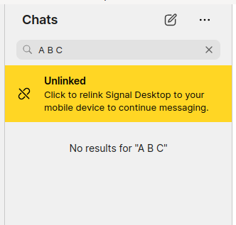

# How search works



- `updateSearchTerm` (`ts/state/ducks/search.ts`)
- `SEARCH_UPDATE` action is dispatched with the text from the input
- `doSearch` (`ts/state/ducks/search.ts`)
- `SEARCH_MESSAGES_RESULTS_FULFILLED` action dispatched

## `doSearch`

```ts
// ts/state/ducks/search.ts
const doSearch = debounce(
  ({
    dispatch,
    allConversations,
    regionCode,
    noteToSelf,
    ourConversationId,
    query,
    searchConversationId,
  }: Readonly<{
    dispatch: ThunkDispatch<
      RootStateType,
      unknown,
      | SearchMessagesResultsFulfilledActionType
      | SearchDiscussionsResultsFulfilledActionType
    >;
    allConversations: ReadonlyArray<ConversationType>;
    noteToSelf: string;
    regionCode: string | undefined;
    ourConversationId: string;
    query: string;
    searchConversationId: undefined | string;
  }>) => {
    if (!query) {
      return;
    }

    log.info("[doSearch]", query);

    // Limit the number of contacts to something reasonable
    const MAX_MATCHING_CONTACTS = 100;

    void (async () => {
      const segmenter = new Intl.Segmenter([], { granularity: "word" });
      const queryWords = [...segmenter.segment(query)]
        .filter((word) => word.isWordLike)
        .map((word) => word.segment);
      const contactServiceIdsMatchingQuery = searchConversationTitles(
        allConversations,
        queryWords
      )
        .filter((conversation) => isDirectConversation(conversation))
        .map((conversation) => conversation.serviceId)
        .filter(isNotNil)
        .slice(0, MAX_MATCHING_CONTACTS);

      const messages = await queryMessages({
        query,
        searchConversationId,
        contactServiceIdsMatchingQuery,
      });

      dispatch({
        type: "SEARCH_MESSAGES_RESULTS_FULFILLED",
        payload: {
          messages,
          query,
        },
      });
    })();

    if (!searchConversationId) {
      void (async () => {
        const { conversationIds, contactIds } =
          await queryConversationsAndContacts(query, {
            ourConversationId,
            noteToSelf,
            regionCode,
            allConversations,
          });

        dispatch({
          type: "SEARCH_DISCUSSIONS_RESULTS_FULFILLED",
          payload: {
            conversationIds,
            contactIds,
            query,
          },
        });
      })();
    }
  },
  200
);
```

### `allConversations`

`allConversations` is derived from `state.conversations` by using the `conversationLookup` lookup.

```ts
// ts/state/getInitialState.ts
conversations: {
  ...conversations(),
  conversationLookup: makeLookup(formattedConversations, 'id'),
  conversationsByE164: makeLookup(formattedConversations, 'e164'),
  conversationsByServiceId: {
    ...makeLookup(formattedConversations, 'serviceId'),
    ...makeLookup(formattedConversations, 'pni'),
  },
  conversationsByGroupId: makeLookup(formattedConversations, 'groupId'),
  conversationsByUsername: makeLookup(formattedConversations, 'username'),
},
```

### `searchConversationTitles`

This is searching in-memory (redux state) over the titles of the chats you have.

This matches on conversation `name` for group conversations or some other combination for private conversations.

```ts
// ts/util/getTitle.ts
export function getTitleNoDefault(
  attributes: ConversationRenderInfoType,
  { isShort = false, ignoreNickname = false }: TitleOptions = {}
): string | undefined {
  if (!isDirectConversation(attributes)) {
    return attributes.name;
  }

  const { username } = attributes;

  let nicknameValue: string | undefined;
  if (areNicknamesEnabled() && !ignoreNickname) {
    nicknameValue =
      (isShort ? attributes.nicknameGivenName : undefined) ||
      getNicknameName(attributes);
  }

  return (
    nicknameValue ||
    (isShort ? attributes.systemGivenName : undefined) ||
    getSystemName(attributes) ||
    (isShort ? attributes.profileName : undefined) ||
    getProfileName(attributes) ||
    getNumber(attributes) ||
    username
  );
}
```

### `queryMessages`

This invokes `window.Signal.Data.searchMessages`. This is something we can control with `DevNullClientInterface`.

### `queryConversationsAndContacts`
