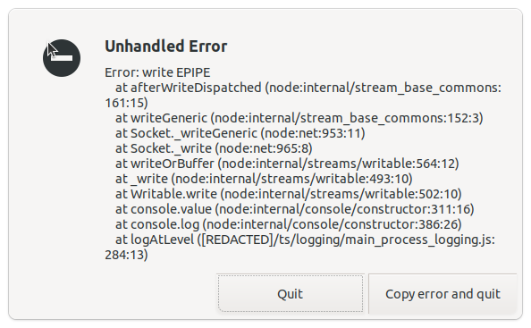

# How UI tests work

```shell
npm run test-mock
```

Running the above command causes a `Signal-Desktop` window to open.

The application is configured with `ts/test-mock/bootstrap.ts`.

The application is then running against a mock server.

The tests are in `ts/test-mock`.

## How to run a single test

```shell
mocha --require ts/test-mock/setup-ci.js {path}
```

For example:

```shell
mocha --require ts/test-mock/setup-ci.js ts/test-mock/messaging/edit_test.js
```

## File uploads

## Errors

### `test-electron`: Error: write EPIPE

```shell
npm run test-mock
```

I find that I can get lots and lots of these error dialogs showing.



Every time I close it another one opens.

```shell
Unhandled Error

Error: write EPIPE
    at afterWriteDispatched (node:internal/stream_base_commons:161:15)
    at writeGeneric (node:internal/stream_base_commons:152:3)
    at Socket._writeGeneric (node:net:953:11)
    at Socket._write (node:net:965:8)
    at writeOrBuffer (node:internal/streams/writable:564:12)
    at _write (node:internal/streams/writable:493:10)
    at Writable.write (node:internal/streams/writable:502:10)
    at console.value (node:internal/console/constructor:311:16)
    at console.error (node:internal/console/constructor:395:26)
    at handleError ([REDACTED]/app/global_errors.js:45:13)
```

The error is being written by `app/global_errors.ts`.

I did find that `htop` showed quite a few `electron` processes running, and killing the first one seemed to stop the windows.
