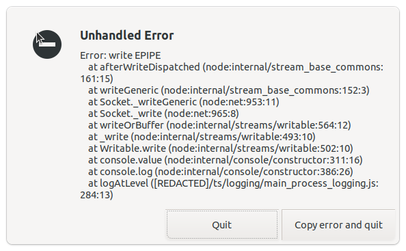

## Error: getaddrinfo ENOTFOUND create.signal.art from `yarn generate`

5-Jun-2024

```shell
$ yarn generate && yarn start
yarn run v1.22.10
$ npm-run-all build-protobuf build:esbuild build:dns-fallback build:icu-types build:compact-locales sass get-expire-time copy-components
$ yarn build-module-protobuf
$ pbjs --target static-module --force-long --no-typeurl --no-verify --no-create --no-convert --wrap commonjs --out ts/protobuf/compiled.js protos/*.proto && pbts --no-comments --out ts/protobuf/compiled.d.ts ts/protobuf/compiled.js
$ node scripts/esbuild.js
$ node ts/scripts/generate-dns-fallback.js
Error: getaddrinfo ENOTFOUND create.signal.art
    at GetAddrInfoReqWrap.onlookupall [as oncomplete] (node:dns:118:26) {
  errno: -3007,
  code: 'ENOTFOUND',
  syscall: 'getaddrinfo',
  hostname: 'create.signal.art'
}
error Command failed with exit code 1.
info Visit https://yarnpkg.com/en/docs/cli/run for documentation about this command.
ERROR: "build:dns-fallback" exited with 1.
error Command failed with exit code 1.
info Visit https://yarnpkg.com/en/docs/cli/run for documentation about this command.
```

```shell
grep -Eir create.signal.art ../Signal-Desktop
../Signal-Desktop/build/dns-fallback.json:    "domain": "create.signal.art",
../Signal-Desktop/ts/scripts/generate-dns-fallback.js:  "create.signal.art"
../Signal-Desktop/ts/scripts/generate-dns-fallback.ts:  'create.signal.art',
../Signal-Desktop/ts/util/createHTTPSAgent.js:  "create.signal.art",
../Signal-Desktop/ts/util/createHTTPSAgent.ts:  'create.signal.art',
../Signal-Desktop/preload.bundle.js:      "create.signal.art",

```

Not quite sure what's going on here, but it does appear `create.signal.art` is not available:

```shell
$ ping create.signal.art
ping: create.signal.art: No address associated with hostname
```

Other hosts work:

```shell
$ ping sfu.voip.signal.org -c 3
PING sfu.voip.signal.org(2600:1901:0:feb2:: (2600:1901:0:feb2::)) 56 data bytes
64 bytes from 2600:1901:0:feb2:: (2600:1901:0:feb2::): icmp_seq=1 ttl=119 time=46.8 ms
64 bytes from 2600:1901:0:feb2:: (2600:1901:0:feb2::): icmp_seq=2 ttl=119 time=46.7 ms
64 bytes from 2600:1901:0:feb2:: (2600:1901:0:feb2::): icmp_seq=3 ttl=119 time=48.8 ms

--- sfu.voip.signal.org ping statistics ---
3 packets transmitted, 3 received, 0% packet loss, time 2004ms
rtt min/avg/max/mdev = 46.701/47.433/48.761/0.940 ms

```

Can fix by editing `ts/scripts/generate-dns-fallback.ts`:

```diff
ben@bang:~/sauce/Signal-Desktop$ git diff ts/scripts/generate-dns-fallback.ts
diff --git a/ts/scripts/generate-dns-fallback.ts b/ts/scripts/generate-dns-fallback.ts
index dec7023df..39f442f4b 100644
--- a/ts/scripts/generate-dns-fallback.ts
+++ b/ts/scripts/generate-dns-fallback.ts
@@ -20,7 +20,6 @@ const FALLBACK_DOMAINS = [
   'cdn3.signal.org',
   'updates2.signal.org',
   'sfu.voip.signal.org',
-  'create.signal.art',
 ];

 async function main() {

```

And re-running:

```shell
$ npm run build:esbuild && npm run build:dns-fallback
```

## `better_sqlite3` ...was compiled against a different Node.js version

```
 Error: The module '/home/ben/sauce/Signal-Desktop/node_modules/@signalapp/better-sqlite3/build/Release/better_sqlite3.node'
was compiled against a different Node.js version using
NODE_MODULE_VERSION 125. This version of Node.js requires
NODE_MODULE_VERSION 115. Please try re-compiling or re-installing
the module (for instance, using `npm rebuild` or `npm install`).

```

## Cannot use import statement outside a module

I got this when running a single test and using incorrect file extension -- make sure you use `image_test.js` instead of `image_test.ts`.

```shell
npm run generate && mocha --require ts/test-mock/setup-ci.js ts/test-mock/messaging/image_test.ts
```

## Electron hangs in the background

### `test-electron`: Error: write EPIPE

```shell
npm run test-electron
```

Sometimes when runining tests I find that I can get lots and lots of these error dialogs showing. I think possibly this happens if I quit the test run using `CTRL+C`.



Every time I close it another one opens.

```shell
Unhandled Error

Error: write EPIPE
    at afterWriteDispatched (node:internal/stream_base_commons:161:15)
    at writeGeneric (node:internal/stream_base_commons:152:3)
    at Socket._writeGeneric (node:net:953:11)
    at Socket._write (node:net:965:8)
    at writeOrBuffer (node:internal/streams/writable:564:12)
    at _write (node:internal/streams/writable:493:10)
    at Writable.write (node:internal/streams/writable:502:10)
    at console.value (node:internal/console/constructor:311:16)
    at console.error (node:internal/console/constructor:395:26)
    at handleError ([REDACTED]/app/global_errors.js:45:13)
```

Solution is to find the `electron` process and kill it.

This is how I did it the last time, I had to kill `chrome_crashpad_handler` first.

```shell
ben@bang:~/sauce/Signal-Desktop$ ps aux | grep electron
ben        36800  3.5  1.8 1191054640 149696 ?   Sl   10:10   0:22 /home/ben/sauce/Signal-Desktop/node_modules/electron/dist/electron /home/ben/sauce/Signal-Desktop
ben        36803  0.0  0.3 33803600 31808 ?      S    10:10   0:00 /home/ben/sauce/Signal-Desktop/node_modules/electron/dist/electron --type=zygote --no-zygote-sandbox
ben        36804  0.0  0.3 33803592 32128 ?      S    10:10   0:00 /home/ben/sauce/Signal-Desktop/node_modules/electron/dist/electron --type=zygote
ben        36806  0.0  0.1 33803592 8900 ?       S    10:10   0:00 /home/ben/sauce/Signal-Desktop/node_modules/electron/dist/electron --type=zygote
ben        36824  0.0  0.0 33567616 1272 ?       Sl   10:10   0:00 /home/ben/sauce/Signal-Desktop/node_modules/electron/dist/chrome_crashpad_handler --monitor-self-annotation=ptype=crashpad-handler --no-rate-limit --database=/home/ben/.config/Signal-test/Crashpad --annotation=_productName=Signal --annotation=_version=7.19.0-alpha.1 --annotation=lsb-release=Ubuntu 22.04.4 LTS --annotation=plat=Linux --annotation=prod=Electron --annotation=ver=31.2.0 --initial-client-fd=43 --shared-client-connection
ben        36878  0.0  0.0      0     0 ?        Z    10:10   0:00 [electron] <defunct>
ben        37747  0.0  0.0      0     0 ?        Z    10:20   0:00 [electron] <defunct>
ben        38210  0.0  0.0   9212  2328 pts/1    S+   10:21   0:00 grep --color=auto electron
ben@bang:~/sauce/Signal-Desktop$ kill 36824
ben@bang:~/sauce/Signal-Desktop$ ps aux | grep electron
ben        36800  3.4  1.8 1191054640 149696 ?   Sl   10:10   0:22 /home/ben/sauce/Signal-Desktop/node_modules/electron/dist/electron /home/ben/sauce/Signal-Desktop
ben        36803  0.0  0.3 33803600 31808 ?      S    10:10   0:00 /home/ben/sauce/Signal-Desktop/node_modules/electron/dist/electron --type=zygote --no-zygote-sandbox
ben        36804  0.0  0.3 33803592 32128 ?      S    10:10   0:00 /home/ben/sauce/Signal-Desktop/node_modules/electron/dist/electron --type=zygote
ben        36806  0.0  0.1 33803592 8900 ?       S    10:10   0:00 /home/ben/sauce/Signal-Desktop/node_modules/electron/dist/electron --type=zygote
ben        36878  0.0  0.0      0     0 ?        Z    10:10   0:00 [electron] <defunct>
ben        37747  0.0  0.0      0     0 ?        Z    10:20   0:00 [electron] <defunct>
ben        38216  0.0  0.0   9212  2224 pts/1    S+   10:21   0:00 grep --color=auto electron
ben@bang:~/sauce/Signal-Desktop$ kill 36800
ben@bang:~/sauce/Signal-Desktop$ ps aux | grep electron
ben        38227  0.0  0.0   9212  2288 pts/1    S+   10:22   0:00 grep --color=auto electron
ben@bang:~/sauce/Signal-Desktop$

```
